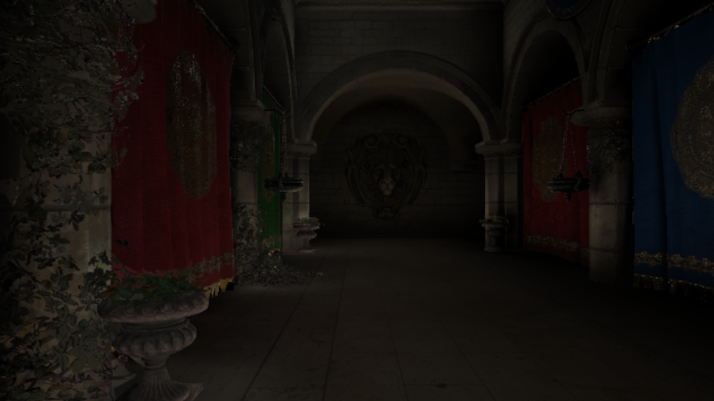
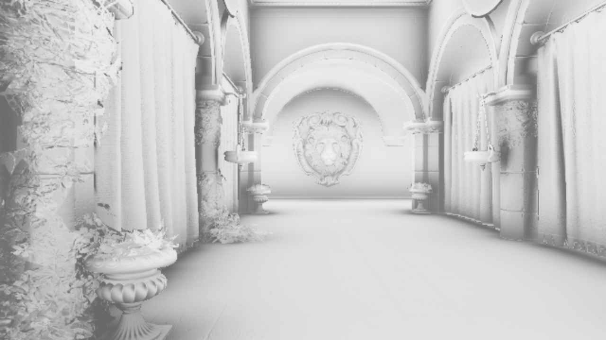

# Voxel Cone Tracing  

  

- [x] Voxel Photon  
    - [x] Octahedral Map  
- [x] Voxelization  
    - [x] ~~RSM (Reflective Shadow Map)~~ **NOT** required  
    - [x] ~~Geometry Shader~~ **NOT** required (suitable for mobile tile-based GPUs)  
- [x] Cone Tracing  
    - [x] Quasi Monte Carlo  

Performance on **NVIDIA GeForce RTX 4080 Laptop GPU**  

RPP (Ray Per Pixel) | Frame Time (ms)  | Frame Rate (FPS)  
:-: | :-: | :-:  
8 | 7 | 140  
16 | 8 | 120  
32 | 12 | 80  

  

  
